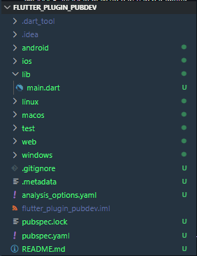
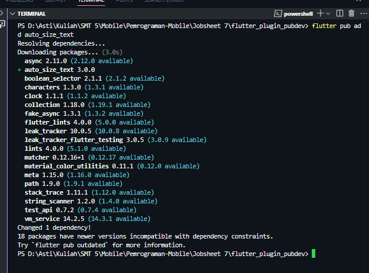
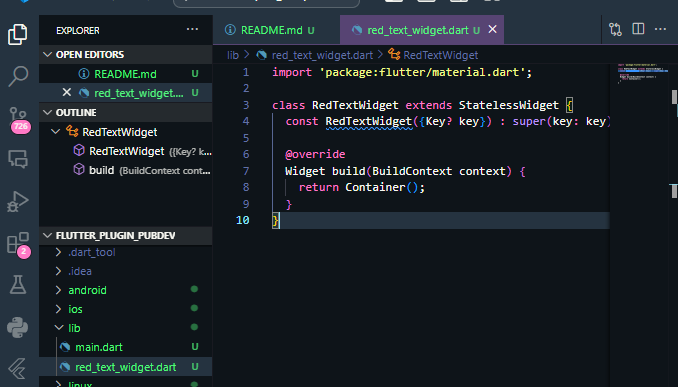
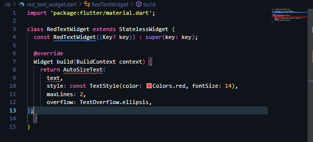
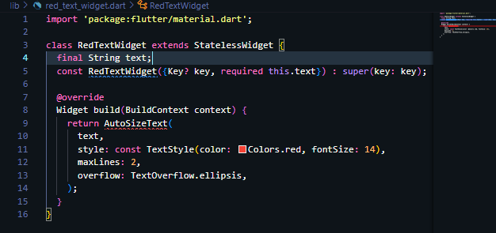
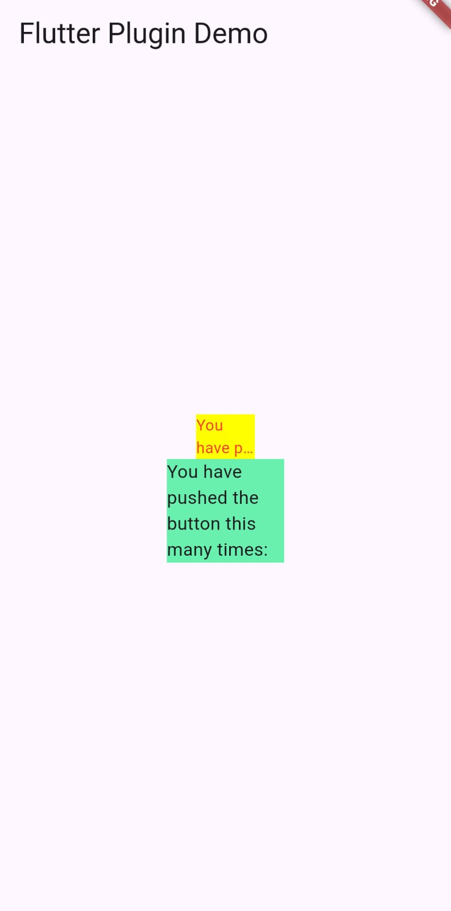

# Tugas Praktikum

### 1. Selesaikan Praktikum tersebut, lalu dokumentasikan dan push ke repository Anda berupa screenshot hasil pekerjaan beserta penjelasannya di file README.md!
- langkah 1 = project baru :  
-langkah 2 = tambah plugin :  
-langkah 3 =  Buat file red_text_widget.dart : 
-langkah 4 = Tambah Widget AutoSizeText :  
-langkah 5 = Buat Variabel text dan parameter di constructor :  
-langkah 6 = Tambahkan widget di main.dart : 
Hasil Praktikum :  

### 2. Jelaskan maksud dari langkah 2 pada praktikum tersebut!
Langkah 2 menambahkan plugin yang memungkinkan teks otomatis menyesuaikan ukuran

### 3. Jelaskan maksud dari langkah 5 pada praktikum tersebut!
Langkah 5 menjadikan widget lebih fleksibel dengan menambahkan parameter teks

### 4. Pada langkah 6 terdapat dua widget yang ditambahkan, jelaskan fungsi dan perbedaannya!
Pada langkah 6, perbedaan utama antara RedTextWidget dan Text terletak pada kemampuan penyesuaian ukuran font otomatis
- RedTextWidget dapat menyesuaikan ukuran font otomatis
- Text tidak dapat menyesuaikan ukuran font otomatis

### 5. Jelaskan maksud dari tiap parameter yang ada di dalam plugin auto_size_text berdasarkan tautan pada dokumentasi ini !
- maxLines : Maksimum jumlah baris yang dapat ditampilkan
- minFontSize : Ukuran font minimum yang dapat ditampilkan
- stepGranularity : Ukuran font yang dapat ditampilkan secara berurutan
- maxFontSize : Ukuran font maksimum yang dapat ditampilkan
- defaultFontSize : Ukuran font default yang dapat ditampilkan
- overflow : Mengatur bagaimana teks akan ditampilkan ketika melebihi bat
- crossAxisAlignment : Mengatur aliran teks di sumbu X
- textDirection : Mengatur arah teks
- style : Mengatur gaya teks
- fit : Mengatur bagaimana teks akan ditampilkan ketika melebihi bat
- overflow : Mengatur bagaimana teks akan ditampilkan ketika melebihi bat

