Praktikum 1: Eksperimen Tipe Data List
Selesaikan langkah-langkah praktikum berikut ini menggunakan VS Code atau Code Editor favorit Anda.
Langkah 1:
Ketik atau salin kode program berikut ke dalam void main()
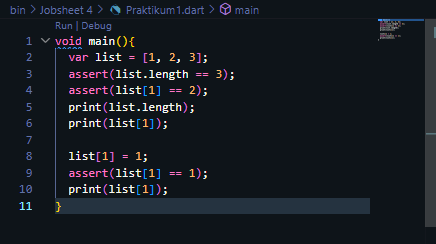

Langkah 2:
Silakan coba eksekusi (Run) kode pada langkah 1 tersebut. Apa yang terjadi? Jelaskan!
Jawab : 
Setelah dirun maka outputnya :
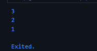
 Yang terjadi adalah :
 - Assert igunakan untuk memvalidasi kondisi tertentu selama eksekusi program.
 - Jika semua assert lolos, program akan berjalan lancar dan mencetak hasil seperti di atas.
 - Jika ada assert yang gagal, misalnya assert(list[1] == 2) tidak benar, program akan berhenti dan memunculkan error.
 - Output yang muncul 1 2 3, dan tidak error karena semua assert diatas benar

Langkah 3:
Ubah kode pada langkah 1 menjadi variabel final yang mempunyai index = 5 dengan default value = null. Isilah nama dan NIM Anda pada elemen index ke-1 dan ke-2. Lalu print dan capture hasilnya.

Apa yang terjadi ? Jika terjadi error, silakan perbaiki.

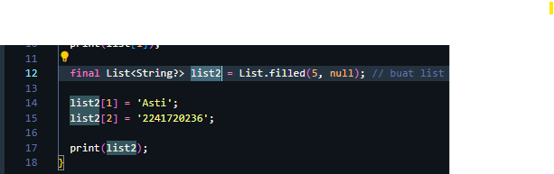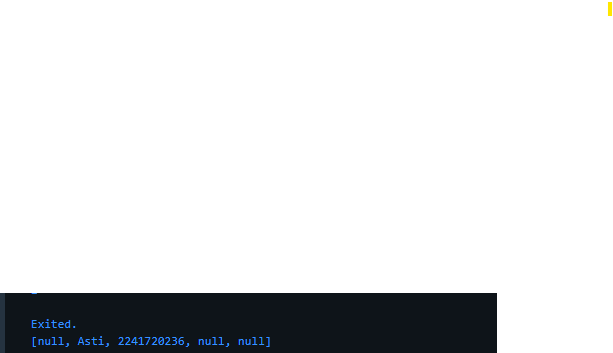

Praktikum 2: Eksperimen Tipe Data Set
Selesaikan langkah-langkah praktikum berikut ini menggunakan VS Code atau Code Editor favorit Anda.

Langkah 1:
Ketik atau salin kode program berikut ke dalam fungsi main().
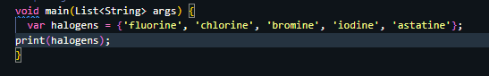

Langkah 2:
Silakan coba eksekusi (Run) kode pada langkah 1 tersebut. Apa yang terjadi? Jelaskan! Lalu perbaiki jika terjadi error.
Jawab : Kode tersebut dapat dirun tanpa error dengan output 
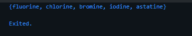 

Langkah 3:
Tambahkan kode program berikut, lalu coba eksekusi (Run) kode Anda.
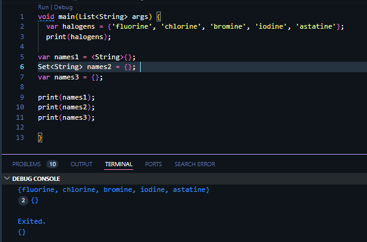
names1 dan names2 adalah Set kosong, jadi akan dicetak sebagai {}.
names3 adalah Map kosong, jadi juga dicetak sebagai {}. 

Apa yang terjadi ? Jika terjadi error, silakan perbaiki namun tetap menggunakan ketiga variabel tersebut. Tambahkan elemen nama dan NIM Anda pada kedua variabel Set tersebut dengan dua fungsi berbeda yaitu .add() dan .addAll(). Untuk variabel Map dihapus, nanti kita coba di praktikum selanjutnya.
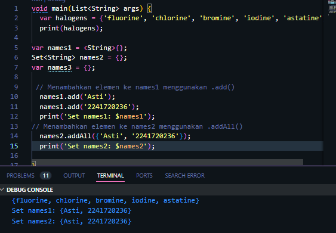
-  Fungsi .add() menambahkan satu elemen ke dalam Set. Di sini, saya menambahkan nama dan NIM ke Set names1 secara individual.
- Fungsi .addAll() digunakan untuk menambahkan beberapa elemen sekaligus ke dalam Set (nama dan NIM)
- Variabel Map sudah dihapus

Praktikum 3: Eksperimen Tipe Data Maps
Selesaikan langkah-langkah praktikum berikut ini menggunakan VS Code atau Code Editor favorit Anda.

Langkah 1:
Ketik atau salin kode program berikut ke dalam fungsi main().
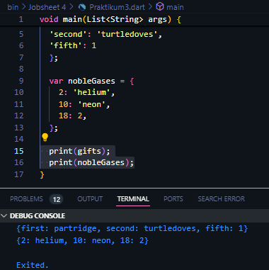

Langkah 2:
Silakan coba eksekusi (Run) kode pada langkah 1 tersebut. Apa yang terjadi? Jelaskan! Lalu perbaiki jika terjadi error.
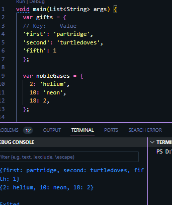
- Kode tersebut tidak error dan mencetak isi dari kedua Map yang telah dideklarasikan.
- Dart dapat menangani Map dengan kunci dan nilai yang memiliki tipe data yang berbeda.

Langkah 3:
Tambahkan kode program berikut, lalu coba eksekusi (Run) kode Anda.
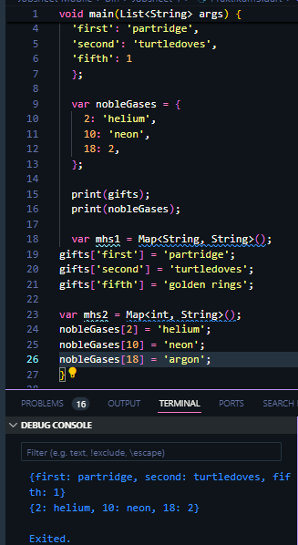
Apa yang terjadi ? Jika terjadi error, silakan perbaiki.
- Setelah kode tersebut ditambahkan dan dirun, tidak terjadi error, karena dart mendukung operasi penambahan dan pengubahan nilai dalam sebuah Map.

Tambahkan elemen nama dan NIM Anda pada tiap variabel di atas (gifts, nobleGases, mhs1, dan mhs2). Dokumentasikan hasilnya dan buat laporannya!
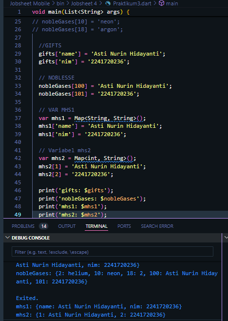

Praktikum 4: Eksperimen Tipe Data List: Spread dan Control-flow Operators

Langkah 1:
Ketik atau salin kode program berikut ke dalam fungsi main().
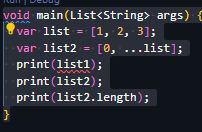
Langkah 2:
Silakan coba eksekusi (Run) kode pada langkah 1 tersebut. Apa yang terjadi? Jelaskan! Lalu perbaiki jika terjadi error.
-Perbaikan Kode : 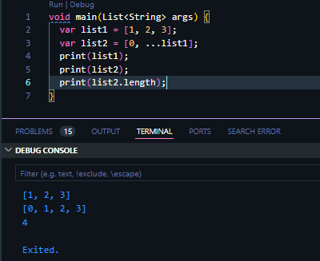
- Kode sebelumnya error karena list1 belum terdefinisi
Langkah 3:
Tambahkan kode program berikut, lalu coba eksekusi (Run) kode Anda.
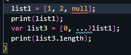
Apa yang terjadi ? Jika terjadi error, silakan perbaiki.
- Kode diatas error karena Dart menggunakan null safety, sebuah fitur yang memastikan bahwa nilai null hanya dapat disimpan di variabel yang memang diizinkan menyimpan null.
- Perbaikan kode : 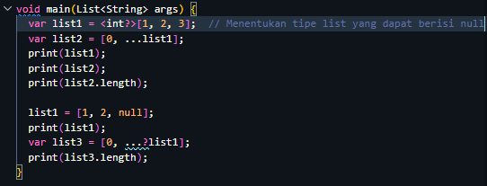

Tambahkan variabel list berisi NIM Anda menggunakan Spread Operators. Dokumentasikan hasilnya dan buat laporannya!
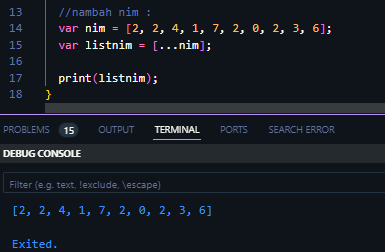

Langkah 4:
Tambahkan kode program berikut, lalu coba eksekusi (Run) kode Anda.
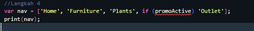
Apa yang terjadi ? Jika terjadi error, silakan perbaiki. Tunjukkan hasilnya jika variabel promoActive ketika true dan false.
- kode tersebut masih error karena promoActive belum didefinisikan
- perbaikan kode :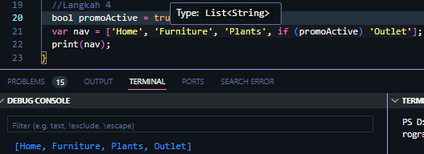
- Jika promoActive bernilai true, maka nav akan berisi ['Home', 'Furniture', 'Plants', 'Outlet'].
- Jika promoActive bernilai false, maka nav akan berisi ['Home', 'Furniture', 'Plants'], dan 'Outlet' tidak akan ditambahkan.

Langkah 5:
Tambahkan kode program berikut, lalu coba eksekusi (Run) kode Anda.
var nav2 = ['Home', 'Furniture', 'Plants', if (login case 'Manager') 'Inventory'];
print(nav2);
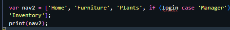
- Kode yang diatas error karena penggunaan sintaks if (login case 'Manager') tidak valid dalam Dart. Dart tidak mendukung ekspresi kondisi case secara langsung di dalam if statement seperti pada bahasa lain.
Apa yang terjadi ? Jika terjadi error, silakan perbaiki. Tunjukkan hasilnya jika variabel login mempunyai kondisi lain
- perbaikan kode : 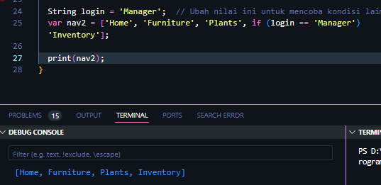

Langkah 6:
Tambahkan kode program berikut, lalu coba eksekusi (Run) kode Anda.

var listOfInts = [1, 2, 3];
var listOfStrings = ['#0', for (var i in listOfInts) '#$i'];
assert(listOfStrings[1] == '#1');
print(listOfStrings);
- 
Apa yang terjadi ? Jika terjadi error, silakan perbaiki. Jelaskan manfaat Collection For dan dokumentasikan hasilnya.
- Kode diatas tidak error karena sudah menggunakan Collection For yang memungkinkan kita untuk membuat list atau set dengan lebih ringkas menggunakan loop.
- 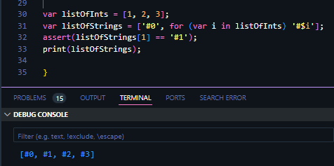 

Praktikum 5: Eksperimen Tipe Data Records

Langkah 1:
Ketik atau salin kode program berikut ke dalam fungsi main().

var record = ('first', a: 2, b: true, 'last');
print(record)
- 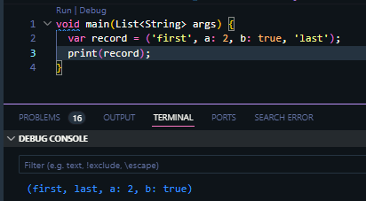

Langkah 2:
Silakan coba eksekusi (Run) kode pada langkah 1 tersebut. Apa yang terjadi? Jelaskan! Lalu perbaiki jika terjadi error.
- Kode terssebut awalnya error karena kurang titik koma, jadi setelah ditambahkan titik koma kode tidak error.
- Output dari kode tersebut adalah : (first, last, a: 2, b: true)
- first dan last dicetak terlebih dahulu karena 'first' dan 'last' diperlakukan sebagai elemen biasa dari tuple. Sedangkan a: 2 dan b: true dianggap sebagai bagian dari parameter bernama, dan oleh karena itu mereka ditampilkan setelah elemen biasa saat dicetak.

Langkah 3:
Tambahkan kode program berikut di luar scope void main(), lalu coba eksekusi (Run) kode Anda.

(int, int) tukar((int, int) record) {
  var (a, b) = record;
  return (b, a);
}
Apa yang terjadi ? Jika terjadi error, silakan perbaiki. Gunakan fungsi tukar() di dalam main() sehingga tampak jelas proses pertukaran value field di dalam Records.
- kode tersebut tidak error, namun ketika dijalankan belum ada output karena
Fungsi tukar tidak dipanggil di dalam fungsi main(). Meskipun fungsi tersebut didefinisikan, tanpa pemanggilan fungsi, tidak ada proses yang terjadi untuk menukar nilai.
- 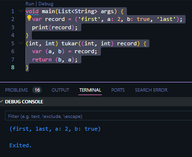
- untuk menampilkan hasilnya, kita harus memanggil fungsi tukar() di dalam main 
- 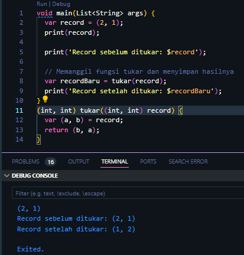

Langkah 4:
Tambahkan kode program berikut di dalam scope void main(), lalu coba eksekusi (Run) kode Anda.

// Record type annotation in a variable declaration:
(String, int) mahasiswa;
print(mahasiswa);
Apa yang terjadi ? Jika terjadi error, silakan perbaiki. Inisialisasi field nama dan NIM Anda pada variabel record mahasiswa di atas. Dokumentasikan hasilnya dan buat laporannya!
- Saat menjalankan print(mahasiswa); sebelum menginisialisasi variabel mahasiswa, ini akan menyebabkan error karena variabel tersebut tidak memiliki nilai (null).
- perbaikan kode : 
- Jadi kita perlu menginisialisasi mahasiswa sebelum menjalankan print(mahasiswa)
- Inisialisasi dengan Nama dan NIM : 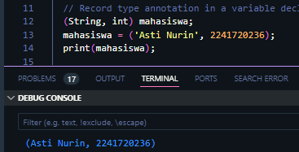

Langkah 5:
Tambahkan kode program berikut di dalam scope void main(), lalu coba eksekusi (Run) kode Anda.

var mahasiswa2 = ('first', a: 2, b: true, 'last');

print(mahasiswa2.$1); // Prints 'first'
print(mahasiswa2.a); // Prints 2
print(mahasiswa2.b); // Prints true
print(mahasiswa2.$2); // Prints 'last'
Apa yang terjadi ? Jika terjadi error, silakan perbaiki. Gantilah salah satu isi record dengan nama dan NIM Anda, lalu dokumentasikan hasilnya dan buat laporannya!
- Mengganti record dengan nama dan nim: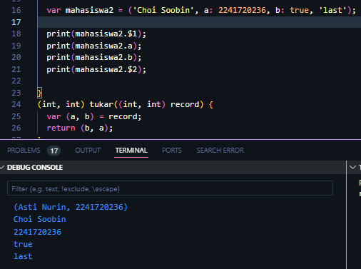

Tugas Praktikum
1. Silakan selesaikan Praktikum 1 sampai 5, lalu dokumentasikan berupa screenshot hasil pekerjaan Anda beserta penjelasannya!
2. Jelaskan yang dimaksud Functions dalam bahasa Dart!
- Jawab : Functions dalam Dart adalah blok kode yang dapat dieksekusi untuk melakukan tugas tertentu. Functions membantu untuk menyusun kode agar lebih modular, mudah dibaca, dan lebih terorganisir. Dart memungkinkan pembuatan fungsi yang dapat menerima parameter dan mengembalikan nilai. Fungsi dapat didefinisikan di dalam atau di luar kelas dan dapat dipanggil di mana saja dalam program.
3. Jelaskan jenis-jenis parameter di Functions beserta contoh sintaksnya!
Jawab : 
- Parameter Posisi (Positional Parameters) : parameter yang didefinisikan dalam urutan tertentu dan harus diberikan saat fungsi dipanggil.
Contoh : `void greet(String nama, int umur) { print('Halo,$name')} 
void main() {
  greet('Soobin'); // Output: Hello, Soobin!
}
-    Parameter Opsional (Optional Parameters) : 
Ada dua jenis parameter opsional: named dan positional.
Positional Optional Parameters menggunakan tanda kurung siku []. 
Contoh :
      void greet(String name, [String? greeting]) {
  print('$greeting, $name!');
}

void main() {
  greet('Soobin'); // Output: null, Soobin!
  greet('Soobin', 'Hi'); // Output: Hi, Soobin!
}

-   Named Parameters :
Named parameters didefinisikan dalam kurung kurawal {} dan dapat diakses dengan nama mereka saat pemanggilan.
Contoh:
void greet({required String name, String greeting = 'Hello'}) {
  print('$greeting, $name!');
}

void main() {
  greet(name: 'Soobin'); // Output: Hello, Soobin!
  greet(name: 'Soobin', greeting: 'Hi'); // Output: Hi, Soobin!
}

4. Jelaskan maksud Functions sebagai first-class objects beserta contoh sintaknya!
- Jawab : functions dianggap sebagai first-class objects, karena functions dapat diperlakukan seperti objek lainnya. Kita bisa menyimpan functions dalam variabel, meneruskan mereka sebagai argumen, dan mengembalikannya dari functions lain.
- Contoh : 
void sayHello() {
  print('Hello!');
}

void main() {
  var greetingFunction = sayHello; // Menyimpan fungsi dalam variabel
  greetingFunction(); // Memanggil fungsi melalui variabel
}

5. Apa itu Anonymous Functions? Jelaskan dan berikan contohnya!
- Jawab :  Anonymous Functions adalah fadalah functions yang tidak memiliki nama dan biasanya digunakan untuk fungsi satu kali, seperti dalam callback. Mereka sering digunakan dengan metode seperti forEach, map, dan lainnya.
- Contoh :
void main() {
  var numbers = [1, 2, 3];
  
  // Menggunakan anonymous function dengan forEach
  numbers.forEach((number) {
    print(number * 2); // Output: 2, 4, 6
  });
}

6. Jelaskan perbedaan Lexical scope dan Lexical closures! Berikan contohnya!
Jawab :
- Lexical Scope: Merupakan aturan yang menentukan cara variabel diakses di dalam fungsi berdasarkan lokasi di mana variabel tersebut dideklarasikan. Variabel yang dideklarasikan dalam suatu fungsi hanya dapat diakses di dalam fungsi itu sendiri. Contoh :
  void main() {
  var x = 10; // x dalam lexical scope

  void printX() {
    print(x); // Mengakses x dari luar
  }
  
  printX(); // Output: 10
}

- Lexical Closures: Merupakan konsep di mana fungsi dapat "mengingat" lingkungan di mana ia didefinisikan, termasuk variabel yang dideklarasikan di luar fungsi. Closure memungkinkan fungsi untuk mengakses variabel dari scope di luar dirinya. Contoh :
  void main() {
  Function closureFunction() {
    var count = 0; // variabel lokal

    return () {
      count++; // Mengakses dan mengubah count
      print(count);
    };
  }

  var increment = closureFunction();
  increment(); // Output: 1
  increment(); // Output: 2
}

7. Jelaskan dengan contoh cara membuat return multiple value di Functions!
Jawab :
- Contoh membuat return multiple value memakai Tuple (Record):
  (int, int) addAndSubtract(int a, int b) {
  return (a + b, a - b);
}

void main() {
  var result = addAndSubtract(10, 5);
  print('Sum: ${result.$1}, Difference: ${result.$2}'); // Output: Sum: 15, Difference: 5
}

- Contoh membuat return multiple value memakai Objek:
  class Result {
  final int sum;
  final int difference;

  Result(this.sum, this.difference);
}

Result addAndSubtract(int a, int b) {
  return Result(a + b, a - b);
}

void main() {
  var result = addAndSubtract(10, 5);
  print('Sum: ${result.sum}, Difference: ${result.difference}'); // Output: Sum: 15, Difference: 5
}
